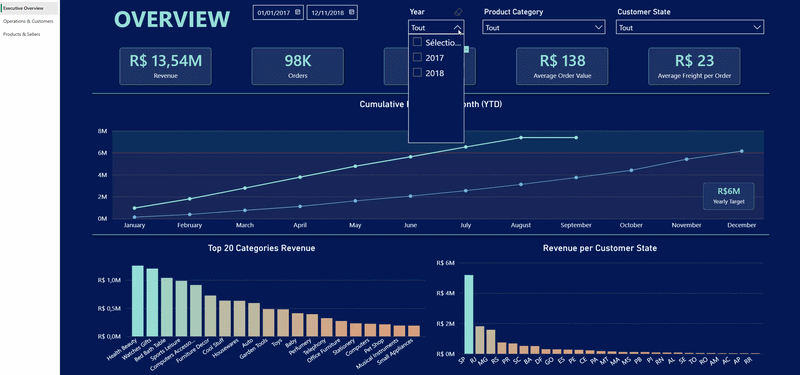
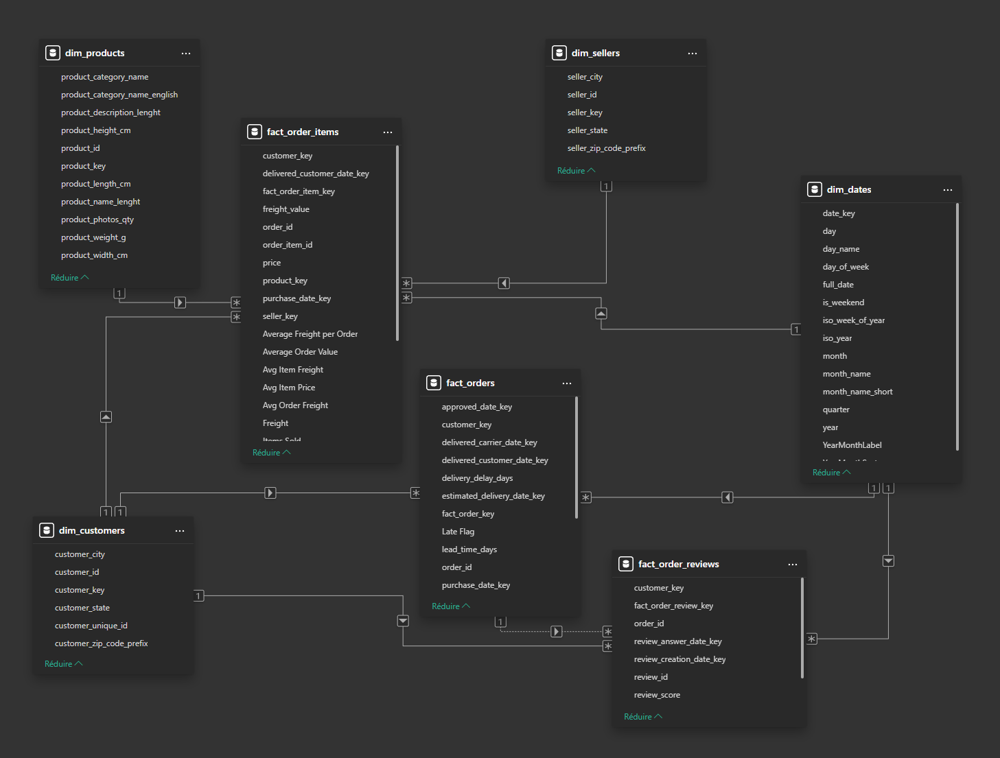

# Olist Data Pipeline & Dashboard Analytics



## Présentation du projet

Ce projet avait pour objectif de consolider les compétences suivantes :

* Data Engineering
* SQL avancé
* Modélisation décisionnelle
* Data Warehousing
* Power BI
* DAX
* Qualité des données

Il consiste en la création d'un pipeline de données de bout en bout à partir du dataset e-commerce Brésilien [Olist](https://www.kaggle.com/datasets/olistbr/brazilian-ecommerce).

L'objectif était de concevoir un workflow analytique complet :

* Ingestion de fichiers CSV dans PostgreSQL
* Nettoyage et structuration des données
* Modélisation décisionnelle
* Création d'un dashboard Power BI interactif orienté business

Le projet suit une architecture en couches :

```text
RAW -> STG -> DWH -> Power BI
```

---

## Stack technique

* PostgreSQL
* SQL
* Power BI (M, DAX)

---

## Dataset

Dataset utilisé :

* [Olist Brazilian E-Commerce Dataset](https://www.kaggle.com/datasets/olistbr/brazilian-ecommerce)
* Source : [Kaggle](https://www.kaggle.com/datasets/olistbr/brazilian-ecommerce)

Les fichiers CSV bruts ne sont pas versionnés dans ce repository.

Pour exécuter le projet localement :

1. Télécharger le [dataset Olist](https://www.kaggle.com/datasets/olistbr/brazilian-ecommerce) depuis Kaggle
2. Créer le dossier suivant localement :

```text
data/raw/
```

3. Placer les fichiers CSV dans ce dossier

---

## Structure du repository

```text
olist-data-pipeline/
│
├── sql/
│   ├── 00_run_all.psql
│   ├── 01_create_schemas.sql
│   ├── 02_create_dq_checks_table.sql
│   ├── 03_create_raw_tables.sql
│   ├── 04_load_raw_csv.psql
│   ├── 05_build_stg.sql
│   └── 06_build_dwh.sql
│
├── powerbi/
│   └── olist_dashboard.pbix
│   └── olist_dashboard.pdf
docs/
├── screenshots/
│   ├── 01_executive_overview.png
│   ├── 02_operations_customers.png
│   ├── 03_products_sellers.png
│   ├── 04_star_model.png
│   └── 05_dq_table.png
│
└── demo/
│   └── dashboard_demo.mp4
│   └── dashboard_demo.gif
│
├── README.md
└── .gitignore
```

---

## Architecture des données

### Couche RAW

* Ingestion directe des fichiers CSV
* Toutes les colonnes sont chargées en TEXT
* Premiers contrôles qualité enregistrés dans `dq.check_results`

### Couche STG

* Typage des colonnes
* Nettoyage des données
* Gestion des valeurs nulles
* Ajout des contraintes et clés primaires
* Contrôles qualité supplémentaires

### Couche DWH

Modèle en étoile optimisé pour Power BI :

* Tables de faits
* Dimensions
* Surrogate keys
* Dimension calendrier
* Tables optimisées pour l'analyse décisionnelle

---

## Contrôles qualité des données

Plusieurs contrôles qualité ont été implémentés tout au long du pipeline :

* Clés métier nulles
* Détection de doublons
* Références manquantes
* Review scores invalides
* Détection d'anomalies
* Contrôles d'intégrité référentielle

Tous les résultats sont historisés dans :

```text
dq.check_results
```

---

## Dashboard Power BI

Le dashboard contient 3 pages analytiques principales.

### 1. Executive Overview

* KPIs de revenu
* Nombre de commandes
* Évolution du chiffre d'affaires
* Comparaison inter-annuelle

### 2. Operations & Customers

* Délais de livraison
* Retards de livraison
* Analyse des notes clients
* Corrélation entre logistique et satisfaction

### 3. Products & Sellers

* Chiffre d'affaires par catégorie et états
* Analyse des frais de port
* Performance produit
* Analyse vendeurs

---

## Modèle de données Power BI

Modèle relationnel dans Power BI :



---

## Points techniques notables

### Surrogate Keys (Clés substitutives)

Les dimensions utilisent des surrogate keys générées automatiquement avec les colonnes identity PostgreSQL.

### Modélisation multi-facts

Le modèle contient plusieurs tables de faits :

* `fact_orders`
* `fact_order_items`
* `fact_order_reviews`

### DAX avancé

Plusieurs techniques DAX avancées ont été utilisées :

* Cumul annuel (YTD)
* Filtrage dynamique avec `TREATAS`
* Gestion du contexte de filtre
* Time intelligence

### Gestion personnalisée du YTD

Une logique YTD personnalisée a été implémentée afin d'éviter que les courbes cumulées continuent après le dernier mois contenant réellement du chiffre d'affaires.

---

## Exécution du pipeline

Depuis le dossier `sql/`, exécuter :

```bash
psql -U postgres -d olist_dwh -f 00_run_all.psql
```


> **Remarques :**<br>
\- On exécute notre pipeline avec **psql** (et non depuis pgAdmin), car ***04\_load\_raw\_csv.psql*** utilise la commande ***\\copy***.<br>
\- ***olist_dwh*** : à adapter en fonction du nom de votre base de données.

---

## Captures et démo du dashboard

Les captures du dashboard sont disponibles dans :

```text
docs/screenshots/
```

Le dashboard Power BI a été publié sur le cloud Power BI Service.

Une courte démonstration vidéo est disponible dans :

```text
docs/demo/dashboard_demo.mp4
```

## Article associé

Retrouvez l'article de présentation de ce projet [ici](https://bigheadmax.github.io/09-pipeline-postgresql-powerbi.html).